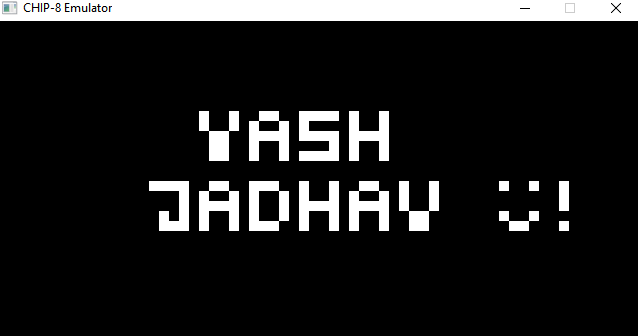
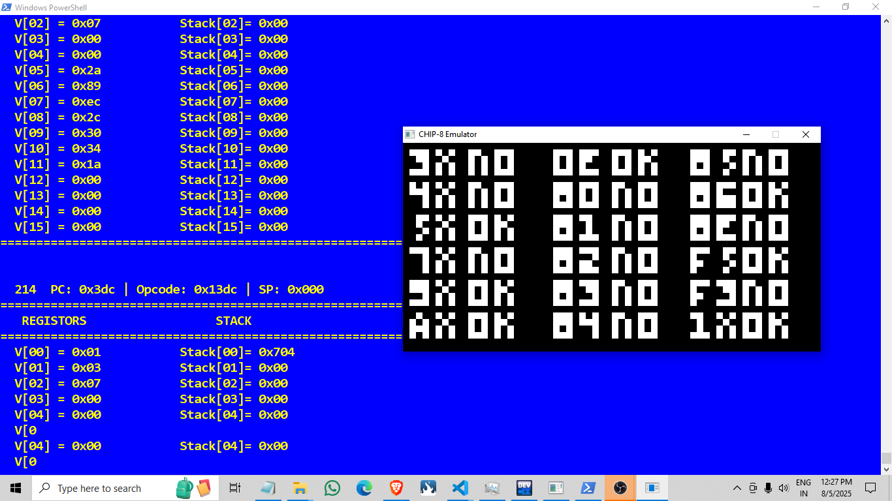
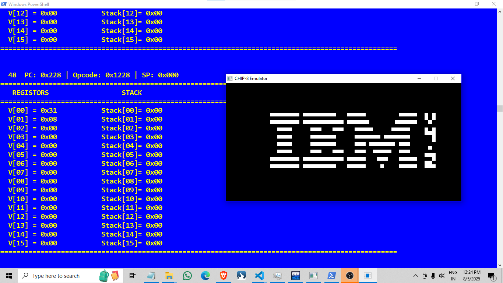

#myname( my rom )




#test_opcode



#IBM




# CHIP 8 Emulator

CHIP-8 is an interpretted programming language developed by Joseph Weisbecker in the mid 70s and was initally used on the COSMAC VIP and Telmac 1800 8-bit microcomputers to make game programming easier. CHIP-8 programs are run using a CHIP-8 virtual machine.

This is a fairly complete implementation of a CHIP-8 virtual machine however there is currently no sound.I have also implemented a console debug code for visualising internnals of CHIP 8 during runtime.

# How to Compile and Run

I have used SDL2(mingw32) with VScode.

## Compile
Open powershell in code folder,

```
Make

 ```

## Run

``` 
./a.exe <scale> <delay> <rom>

```

## References

https://github.com/JamesGriffin/CHIP-8-Emulator/tree/master
https://austinmorlan.com/posts/chip8_emulator/


